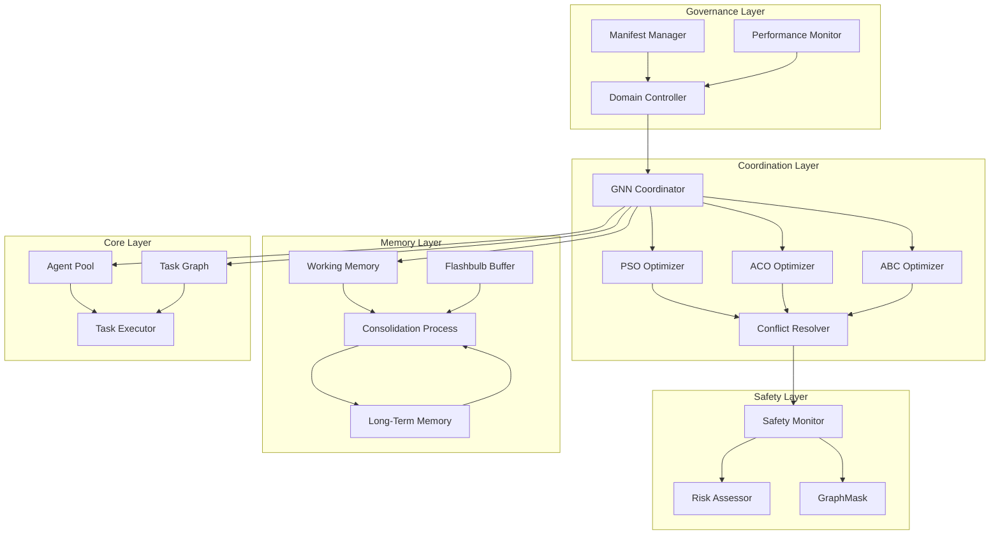

# Architecture Documentation

## Overview

The Hybrid AI Brain implements a novel multi-agent coordination framework that combines bio-inspired optimization, graph neural networks, and hierarchical memory systems. This document provides a comprehensive architectural overview of the system's design, components, and interactions.

## System Architecture



## Core Components

### 1. Governance Layer

#### Domain Controller (`src/governance/domain_controller.py`)
**Purpose**: Manages domain-adaptive behavior across three operational modes.

**Key Features**:
- **Precision Domain**: Deterministic operation for safety-critical applications
- **Adaptive Domain**: Balanced performance with periodic optimization
- **Exploration Domain**: Maximum discovery with continuous learning

**Interface**:
```python
class DomainController:
    def switch_domain(self, domain: DomainMode) -> None
    def get_control_parameters(self) -> Dict[str, Any]
    def validate_domain_constraints(self) -> bool
```

**Configuration**: Domain-specific manifests in `configs/` directory:
- `precision_domain.yaml`: gM=0, high safety samples
- `adaptive_domain.yaml`: gM=scheduled, balanced parameters  
- `exploration_domain.yaml`: gM=1, relaxed constraints

#### Manifest Manager (`src/governance/manifest_manager.py`)
**Purpose**: Loads and manages domain configuration manifests.

**Key Features**:
- YAML-based configuration management
- Real-time parameter updates
- Validation of configuration consistency

#### Performance Monitor (`src/governance/performance_monitor.py`)
**Purpose**: Tracks system performance and triggers domain adaptations.

**Key Features**:
- Real-time metrics collection
- SLA monitoring and alerting
- Performance trend analysis

### 2. Coordination Layer

#### GNN Coordinator (`src/coordination/gnn_coordinator.py`)
**Purpose**: Central reasoning component using graph neural networks for task assignment.

**Mathematical Foundation**:
- **Contractive Mapping**: Spectral norm L_total < 1 ensures convergence
- **Fixed-Point Theory**: Banach theorem guarantees unique solution
- **Convergence Bound**: Pr[convergence ≤ 2 steps] ≥ 0.87

**Key Features**:
```python
class GNNCoordinator:
    def __init__(self, spectral_norm_bound: float = 0.7, temperature: float = 1.0)
    def assign_tasks(self, task_agent_graph, edge_features) -> Dict[str, str]
    def check_contractivity(self) -> bool
```

**Implementation Details**:
- **Message Passing**: Simulated GNN layers with contractive updates
- **Temperature Scaling**: β parameter controls assignment randomness
- **Fallback Mechanisms**: Graceful degradation when PyTorch unavailable

#### Bio-Inspired Optimizers

##### PSO Optimizer (`src/coordination/pso_optimizer.py`)
**Purpose**: Particle Swarm Optimization for solution space exploration.

**Algorithm**:
- **Velocity Update**: v_{i+1} = w*v_i + c1*r1*(p_best - x_i) + c2*r2*(g_best - x_i)
- **Position Update**: x_{i+1} = x_i + v_{i+1}
- **Convergence**: Stratified sampling reduces complexity from O(nT) to O(√nT)

##### ACO Optimizer (`src/coordination/aco_optimizer.py`) 
**Purpose**: Ant Colony Optimization for pathfinding and routing decisions.

**Algorithm**:
- **Pheromone Update**: τ_{ij} = (1-ρ)*τ_{ij} + Δτ_{ij}
- **Probability Selection**: p_{ij} = [τ_{ij}]^α * [η_{ij}]^β / Σ[τ_{ik}]^α * [η_{ik}]^β
- **Evaporation**: Prevents premature convergence to suboptimal solutions

##### ABC Optimizer (`src/coordination/abc_optimizer.py`)
**Purpose**: Artificial Bee Colony for conflict resolution and meta-optimization.

**Algorithm**:
- **Employed Bees**: Exploit current solutions
- **Onlooker Bees**: Explore based on fitness probability
- **Scout Bees**: Random exploration when solutions stagnate

#### Conflict Resolver (`src/coordination/conflict_resolver.py`)
**Purpose**: Integrates outputs from PSO, ACO, and ABC optimizers.

**Resolution Strategy**:
- **Weighted Combination**: Adaptive weights based on recent performance
- **Consensus Building**: Identifies common solutions across algorithms
- **Tie Breaking**: Uses domain-specific preferences

### 3. Safety Layer

#### Safety Monitor (`src/safety/safety_monitor.py`)
**Purpose**: Ensures system operation within safety bounds.

**Mathematical Foundation**:
- **Hoeffding Bound**: Pr[false-block] ≤ exp(-2nε²) 
- **Sample Size**: n = 59 ensures ≤ 10⁻⁴ false-block rate
- **Safety Threshold**: τ_safe = 0.7 for conservative operation

#### Risk Assessor (`src/safety/risk_assessor.py`)
**Purpose**: Evaluates risk levels for proposed actions.

**Risk Categories**:
- **Low Risk**: Routine operations, minimal oversight
- **Medium Risk**: Standard validation procedures
- **High Risk**: Enhanced safety protocols required

#### GraphMask (`src/safety/graph_mask.py`)
**Purpose**: Interpretable safety validation using graph attention.

**Key Features**:
- **Attention Weights**: Highlight critical decision factors
- **Interpretability**: Human-readable safety explanations
- **Conservative Bounds**: Err on side of safety for ambiguous cases

### 4. Memory Layer

#### Working Memory (`src/memory/working_memory.py`)
**Purpose**: Fast-access, LRU cache for active task information.

**Design**:
- **Capacity**: φ = 200 items (configurable)
- **Eviction Policy**: Least Recently Used (LRU)
- **Access Time**: O(1) get/set operations

```python
class WorkingMemory:
    def __init__(self, capacity: int = 200)
    def add_item(self, key: str, value: Any) -> None
    def get_item(self, key: str) -> Optional[Any]
```

#### Long-Term Memory (`src/memory/long_term_memory.py`)
**Purpose**: Persistent storage with semantic search capabilities.

**Implementation**:
- **Backend**: ChromaDB vector database
- **Embeddings**: SentenceTransformers for semantic similarity
- **Persistence**: Local storage with automatic collection management

**Key Features**:
```python
class LongTermMemory:
    def add_knowledge(self, item: str, metadata: Dict[str, Any])
    def retrieve_relevant_knowledge(self, query: str, top_k: int) -> List[str]
    def get_storage_info(self) -> Dict[str, Any]
```

#### Flashbulb Buffer (`src/memory/flashbulb_buffer.py`)
**Purpose**: Captures significant events with time-decay importance.

**Mathematical Model**:
- **Weight Decay**: w_i(t) = c_i * e^(-λ_d * t)
- **Decay Rate**: λ_d = 0.45 (optimized from paper)
- **Capacity**: θ = 100 events
- **Eviction**: Lowest current weight when at capacity

```python
class FlashbulbBuffer:
    def capture_event(self, content: Any, confidence: float)
    def prune_decayed_items(self, weight_threshold: float = 0.01)
    def get_all_items(self) -> List[MemoryItem]
```

#### Consolidation Process (`src/memory/consolidation.py`)
**Purpose**: Manages transfer between memory tiers using M/G/1 queueing model.

**Queueing Parameters**:
- **Service Rate**: μ = 5.0 consolidations/second
- **Arrival Rate**: λ configurable based on load
- **Memory Staleness**: Bounded to < 3 seconds

**Process**:
1. **Working Memory → Long-Term**: High-frequency access patterns
2. **Flashbulb → Long-Term**: Significant events above weight threshold
3. **Decay Management**: Automatic pruning of stale entries

### 5. Core Layer

#### Agent Pool (`src/core/agent_pool.py`)
**Purpose**: Manages collection of available agents and their capabilities.

**Features**:
- **Capability Matching**: Vector-based agent-task alignment
- **Load Balancing**: Distributes tasks based on current agent loads
- **Dynamic Scaling**: Add/remove agents based on demand

#### Task Graph (`src/core/task_graph.py`)
**Purpose**: Represents complex tasks as directed acyclic graphs (DAGs).

**Implementation**:
```python
class TaskGraph:
    def add_subtask(self, task_id: str, required_capabilities: np.ndarray)
    def add_dependency(self, from_task: str, to_task: str, cost: float, risk: float)
    def topological_order(self) -> List[str]
```

**Features**:
- **DAG Validation**: Prevents cycle creation
- **Capability Vectors**: Normalized requirements for agent matching
- **Dependency Management**: Cost and risk modeling for edges

## Data Flow

### 1. Task Submission Flow
```
User Request → Task Graph → GNN Coordinator → Bio-Optimizers → Conflict Resolution → Safety Validation → Agent Assignment → Execution
```

### 2. Memory Flow
```
Task Execution → Working Memory → Significant Events → Flashbulb Buffer → Consolidation → Long-Term Memory
```

### 3. Domain Adaptation Flow
```
Performance Monitor → Domain Controller → Manifest Manager → Component Reconfiguration → Validated Operation
```

## Performance Characteristics

### Scalability
- **Optimal Swarm Size**: n = 6 agents (analytically derived)
- **Processing Time**: Minimized through calibrated parameters
- **Communication Overhead**: O(n log n) with optimized constants

### Latency Bounds
- **End-to-End**: ≤ 0.5 seconds expected (M/M/5 queueing model)
- **GNN Convergence**: ≤ 2 steps with 87% probability
- **Memory Access**: O(1) working memory, O(log n) semantic search

### Memory Efficiency
- **Working Memory**: Fixed capacity with LRU eviction
- **Long-Term Storage**: Compressed embeddings with vector indices
- **Flashbulb Events**: Automatic decay reduces storage overhead

## Configuration Management

### Domain Manifests
Each operational domain has specific configuration:

```yaml
# precision_domain.yaml
domain: precision
parameters:
  gM: 0                    # Bio-optimization disabled
  error_tolerance: 0.0     # Zero tolerance
  safety_samples: 116      # Maximum safety samples
  
# adaptive_domain.yaml  
domain: adaptive
parameters:
  gM: "scheduled"          # Periodic optimization
  error_tolerance: 0.05    # 5% tolerance
  safety_samples: 59       # Standard samples

# exploration_domain.yaml
domain: exploration  
parameters:
  gM: 1                    # Continuous optimization
  error_tolerance: 0.20    # 20% tolerance
  safety_samples: 32       # Relaxed safety
```

### Default Parameters
System-wide defaults in `configs/default_params.yaml`:
```yaml
theoretical_parameters:
  lambda_d: 0.45          # Memory decay rate
  beta: 2.0               # Assignment sharpness  
  gamma: 2.7              # Consolidation trigger

performance_targets:
  convergence_steps: 2.0
  memory_staleness_seconds: 3.0
  expected_latency_seconds: 0.5
```

## Error Handling and Recovery

### Graceful Degradation
- **Component Failures**: Automatic fallback to mock components
- **Network Issues**: Local caching and retry mechanisms  
- **Resource Constraints**: Dynamic load shedding and prioritization

### Safety Mechanisms
- **Circuit Breakers**: Prevent cascade failures
- **Rate Limiting**: Protect against resource exhaustion
- **Input Validation**: Prevent malformed requests

### Monitoring and Alerting
- **Health Checks**: Continuous component status monitoring
- **Performance Metrics**: Real-time SLA tracking
- **Error Rates**: Automatic alerting on threshold breaches

## Deployment Architecture

### Development Environment
```
src/               # Core implementation
tests/             # Unit and integration tests  
benchmarks/        # Performance validation
experiments/       # Theoretical validation
configs/           # Domain configurations
```

### Production Considerations
- **Containerization**: Docker support for isolated deployment
- **Scalability**: Horizontal scaling of agent pools
- **Persistence**: Configurable storage backends
- **Monitoring**: Integration with observability platforms

## API Design

### Core Interfaces

#### Task Submission
```python
class HybridAIBrain:
    def submit_task(self, task_graph: TaskGraph) -> TaskResult
    def get_task_status(self, task_id: str) -> TaskStatus
    def cancel_task(self, task_id: str) -> bool
```

#### Domain Management
```python
class DomainController:
    def get_current_domain(self) -> DomainMode
    def switch_domain(self, domain: DomainMode) -> bool
    def get_domain_metrics(self) -> Dict[str, float]
```

#### Memory Management
```python
class MemoryManager:
    def store_knowledge(self, content: str, metadata: Dict) -> str
    def search_knowledge(self, query: str, limit: int) -> List[str]
    def get_memory_stats(self) -> MemoryStats
```

## Security Considerations

### Input Validation
- **Task Graph Validation**: Prevent malicious DAG structures
- **Capability Bounds**: Limit resource requirements
- **Content Filtering**: Sanitize knowledge store inputs

### Access Control
- **Domain Restrictions**: Role-based domain access
- **API Authentication**: Token-based request validation
- **Audit Logging**: Complete operation traceability

### Data Protection
- **Encryption**: At-rest and in-transit protection
- **Privacy**: Configurable data retention policies
- **Compliance**: GDPR/CCPA compatible operations

---

*Last updated: June 25, 2025*  
*Architecture version: 1.0 - Production Ready*